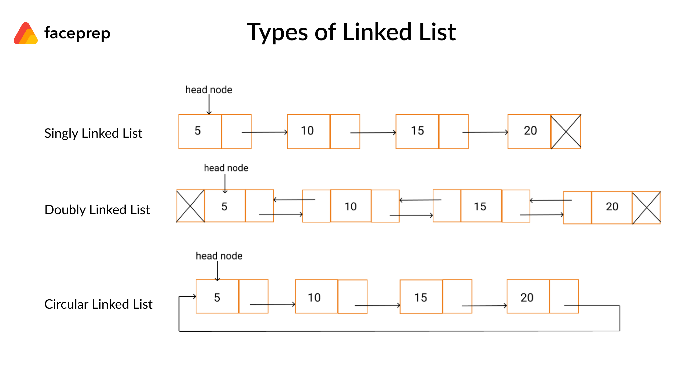

#Data Structures

###Arrays
- Arrays are probably the most common data structure used to store collections of elements
- An array allocates memory for all its elements lumped together as one block of memory

###Linked Lists
- Linked lists and arrays are similar since they both store collections of data. The specific type of elements
  are not important.
- Types of linked list: single , doubly, circular, chunk 

###Stack ( LIFO or FILO )
- Stack is a linear data structure which follows a particular order in which the operations are performed. The order may be LIFO(Last In First Out) or FILO(First In Last Out).
- There are many real-life examples of a stack. Consider an example of plates stacked over one another in the canteen. The plate which is at the top is the first one to be removed
- An array or linked list is the natural choice to implement this structure. push(), pop(), isEmpty() and peek() all take O(1) time. We do not run any loop in any of these operations 

###Queue ( FIFO )
- A Queue is a linear structure which follows a particular order in which the operations are performed. The order is First In First Out (FIFO). A good example of a queue is any queue of consumers for a resource where the consumer that came first is served first. The difference between stacks and queues is in removing. In a stack we remove the item the most recently added; in a queue, we remove the item the least recently added.
- A doubly linked list has O(1) insertion and deletion at both ends, so it is a natural choice for queues.

###Hash Map
- In computing, a hash map is a data structure that implements an associative array abstract data type, a structure that can map keys to values. A hash table uses a hash function to compute an index, also called a hash code, into an array of buckets or slots, from which the desired value can be found. During lookup, the key is hashed and the resulting hash indicates where the corresponding value is stored.
- Hashing: is used to map data of an arbitrary size to data of a fixed size. Use a hash func (SHA-256)
- Collision problems are solved with two different approaches:
    * Open Hashing (Separate chaining): in separate chaining, each bucket is independent, and contains a list of entries for each index. The time for hash map operations is the time to find the bucket (constant time), plus the time to iterate through the list
    * Closed Hashing (Open Addressing): in open addressing, when a new entry is inserted, the buckets are examined, starting with the hashed-to-slot and proceeding in some sequence, until an unoccupied slot is found. The name open addressing refers to the fact that the location of an item is not always determined by its hash value
        - Linear Probing
        - Quadratic Probing
        - Double hashing

###Tree
- In computer science, a tree is a widely used abstract data type that simulates a hierarchical tree structure, with a root value and subtrees of children with a parent node, represented as a set of linked nodes.
- A tree data structure can be defined recursively as a collection of nodes (starting at a root node), where each node is a data structure consisting of a value, together with a list of references to nodes (the "children"), with the constraints that no reference is duplicated, and none points to the root.

###Binary Tree
- A binary tree is made of nodes, where each node contains a "left" pointer, a "right" pointer, and a data element. The "root" pointer points to the topmost node in the tree. The left and right pointers recursively point to smaller "subtrees" on either side. A null pointer represents a binary tree with no elements -- the empty tree. The formal recursive definition is: a binary tree is either empty (represented by a null pointer), or is made of a single node, where the left and right pointers (recursive definition ahead) each point to a binary tree.
- [The basics of binary tree](https://dev.to/jenshaw/the-basics-of-binary-trees-2kf8)
- [Stanford paper](http://cslibrary.stanford.edu/110/BinaryTrees.pdf)

###Binary Tree Search - BST

- A "binary search tree" (BST) or "ordered binary tree" is a type of binary tree where the nodes are arranged in order: for each node, all elements in its left subtree are less-or-equal to the node (<=), and all the elements in its right subtree are greater than the node (>). The tree shown above is a binary search tree -- the "root" node is a 5, and its left subtree nodes (1, 3, 4) are <= 5, and its right subtree nodes (6, 9) are > 5. Recursively, each of the subtrees must also obey the binary search tree constraint: in the (1, 3, 4) subtree, the 3 is the root, the 1 <= 3 and 4 > 3. Watch out for the exact wording in the problems -- a "binary search tree" is different from a "binary tree". The nodes at the bottom edge of the tree have empty subtrees and are called "leaf" nodes (1, 4, 6) while the others are "internal" nodes (3, 5, 9).
- Are especially useful in algorithms because they are naturally sorted, which makes search, insertion, and deletion of values especially quick and efficient
- BST Animation:

###Trie (radix tree - prefix tree - digital tree)
- In computer science, a trie, also called digital tree or prefix tree, is a type of search tree, a tree data structure used for locating specific keys from within a set. These keys are most often strings, with links between nodes defined not by the entire key, but by individual characters. In order to access a key (to recover its value, change it, or remove it), the trie is traversed depth-first, following the links between nodes, which represent each character in the key.
- Unlike a binary search tree, nodes in the trie do not store their associated key. Instead, a node's position in the trie defines the key with which it is associated. This distributes the value of each key across the data structure, and means that not every node necessarily has an associated value.
- All the children of a node have a common prefix of the string associated with that parent node, and the root is associated with the empty string. This task of storing data accessible by its prefix can be accomplished in a memory-optimized way by employing a radix tree.

###Fenwick Tree (binary indexed tree) && Segment Tree 
- [Fenwick tree](https://www.geeksforgeeks.org/binary-indexed-tree-or-fenwick-tree-2/)
- [Segment tree](https://www.geeksforgeeks.org/segment-tree-set-1-sum-of-given-range/)
- O(log n)

###Heap
- A Heap is a specialized tree based structure data structure that satisfies the heap property: if A is a parent node of B, then the key (the value) of node A is ordered with respect to the key of node B with the same ordering applying across the entire heap. A heap can be classified further as either a "max heap" or a "min heap". In a max heap, the keys of parent nodes are always greater than or equal to those of the children and the highest key is in the root node. In a min heap, the keys of parent nodes are less than or equal to those of the children and the lowest key is in the root node
- Time Complexity:
    * Access Max / Min: O(1)
    * Insert: O(log(n))
    * Remove Max / Min: O(log(n))

- MIN Heap

- MAX Heap

###Graph
- A Graph is an ordered pair of G = (V, E) comprising a set V of vertices or nodes together with a set E of edges or arcs, which are 2-element subsets of V (i.e. an edge is associated with two vertices, and that association takes the form of the unordered pair comprising those two vertices)
- Types of Graphs:a    
    * Undirected Graph: a graph in which the adjacency relation is symmetric. So if there exists an edge from node u to node v (u -> v), then it is also the case that there exists an edge from node v to node u (v -> u)
    * Directed Graph: a graph in which the adjacency relation is not symmetric. So if there exists an edge from node u to node v (u -> v), this does not imply that there exists an edge from node v to node u (v -> u)

###Pointers and Memory

- Pointer Rules Summary
    * A pointer stores a reference to its pointee. The pointee, in turn, stores
something useful.
    * The dereference operation on a pointer accesses its pointee. A pointer may
only be dereferenced after it has been assigned to refer to a pointee. Most
pointer bugs involve violating this one rule.
    * Allocating a pointer does not automatically assign it to refer to a pointee.
Assigning the pointer to refer to a specific pointee is a separate operation
which is easy to forget.
    * Assignment between two pointers makes them refer to the same pointee
which introduces sharing.

- Local Memory
    * Summary: Local memory (Section 2) is quite automatic — it is allocated automatically on
      function call and it is deallocated automatically when a function exits

- Heap Memory ( dynamic memory )
    * The programmer explicitly requests the allocation of a memory "block" of a particular size, 
      and the block continues to be allocated until the programmer explicitly requests that it 
      be deallocated
    * The advantages of heap memory are:
        - Lifetime. Because the programmer now controls exactly when memory is
          allocated and deallocated, it is possible to build a data structure in
          memory, and return that data structure to the caller. This was never
          possible with local memory which was automatically deallocated when the
          function exited.
        - Size. The size of allocated memory can be controlled with more detail.
          For example, a string buffer can be allocated at run-time which is exactly
          the right size to hold a particular string. With local memory, the code is
          more likely to declare a buffer size 1000 and hope for the best.
    * The disadvantages of heap memory are:
        - More Work. Heap allocation needs to arranged explicitly in the code
          which is just more work.
        - More Bugs. Because it's now done explicitly in the code, realistically on
          occasion the allocation will be done incorrectly leading to memory bugs. Local 
          memory is constrained, but at least it's never wrong.

### Links:
- ####[UC Berkeley Data Structures](https://archive.org/details/ucberkeley-webcast?&and%5B%5D=subject%3A%22Computer%20Science%22&and%5B%5D=subject%3A%22CS%22)
- ####[MIT Advanced Data Structures](https://www.youtube.com/watch?v=T0yzrZL1py0&list=PLUl4u3cNGP61hsJNdULdudlRL493b-XZf&index=1)

###Credits:
- ####[https://dev.to/jenshaw/the-basics-of-binary-trees-2kf8](https://dev.to/jenshaw/the-basics-of-binary-trees-2kf8)
- ####[http://cslibrary.stanford.edu/](http://cslibrary.stanford.edu/)
- ####[https://github.com/kdn251/interviews](https://github.com/kdn251/interviews)

