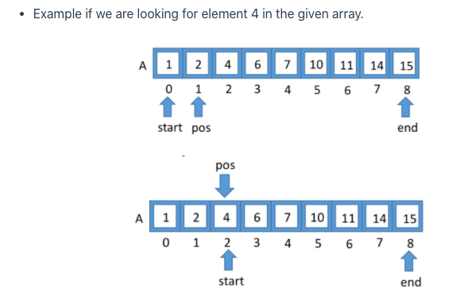
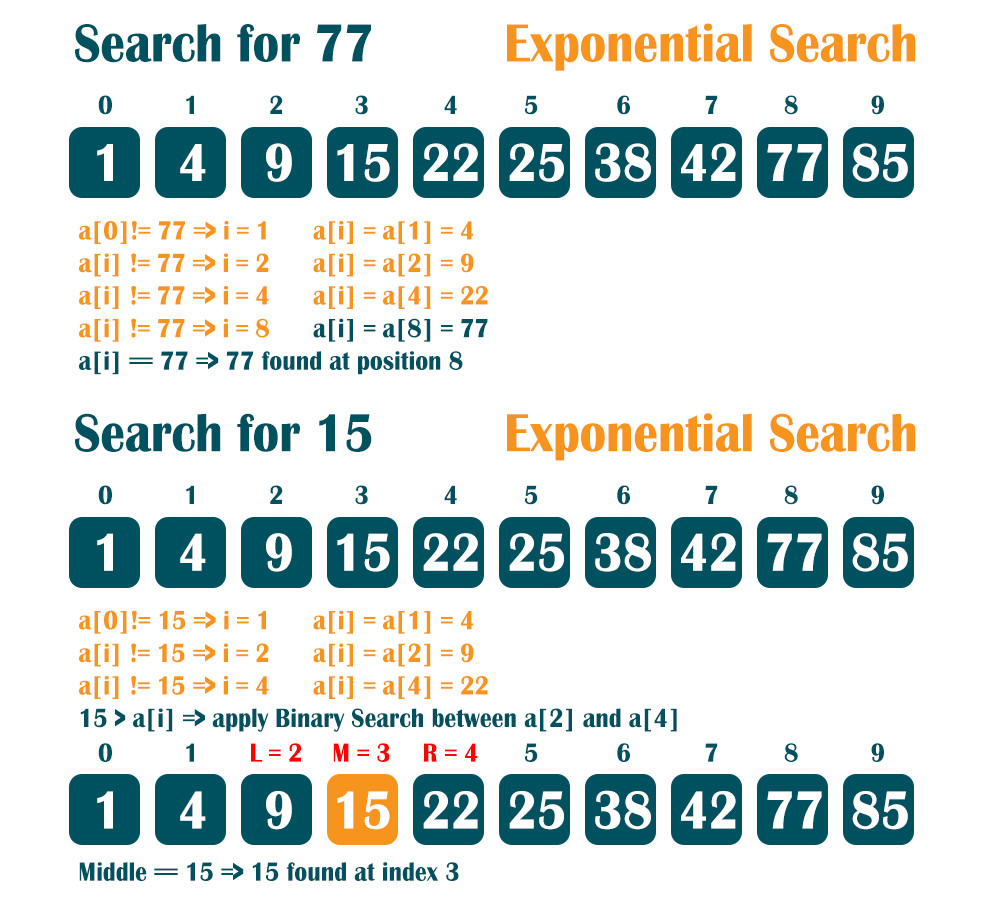
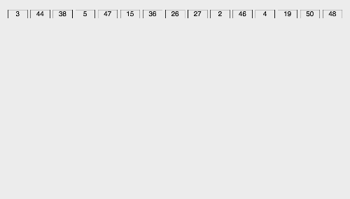
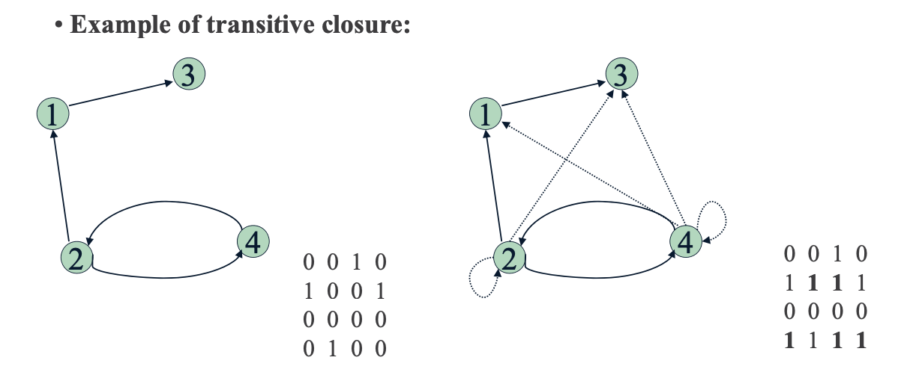

#Algorithms

##Links
- [MIT Introduction to Algorithms](https://www.youtube.com/watch?v=HtSuA80QTyo&list=PLUl4u3cNGP61Oq3tWYp6V_F-5jb5L2iHb&index=1)
- [MIT Advanced Algorithms](https://www.youtube.com/playlist?list=PL6ogFv-ieghdoGKGg2Bik3Gl1glBTEu8c)
- [UC Berkeley Algorithms](https://archive.org/details/ucberkeley-webcast?&and%5B%5D=subject%3A%22Computer%20Science%22&and%5B%5D=subject%3A%22CS%22)
- [Divide and Conquer](https://medium.com/techie-delight/divide-and-conquer-interview-questions-and-practice-problems-8855e45f4200)
- [Recursion](https://www.geeksforgeeks.org/recursion/)
- [Backtracking](https://www.geeksforgeeks.org/backtracking-introduction/)
- [Dynamic Programming](https://www.geeksforgeeks.org/dynamic-programming/)
- [Brute Force Search](https://en.wikipedia.org/wiki/Brute-force_search)

##Search algorithms
- ### Linear Search
    * Given an array of 'n' elements this algorithm is O(n) 
    * Given a multidimensional array of 'n' elements this algorithm is O(n^d) where d = dimensions 

    

- ### Binary Search
    * Given an sorted array, take the middle element and compare with the target value and if not equal discard the half of array that we know the target value is impossible to be there. And then continue with the same process
    * O(log(N))
    
    
  
- ### Jump Search
    * Like Binary Search, Jump Search is a searching algorithm for sorted arrays. The basic idea is to check fewer elements (than linear search) by jumping ahead by fixed steps or skipping some elements in place of searching all elements.
    * The optimal size of a block to be jumped is (√n). This makes the time complexity of Jump Search O(√n).
    * Binary Search is better than Jump Search, but Jump search has an advantage that we traverse back only once (Binary Search may require up to O(Log n) jumps, consider a situation where the element to be searched is the smallest element or smaller than the smallest). So in a system where binary search is costly, we use Jump Search.
    * Example: find 34
    
    
  
- ### Interpolation Search
    * The Interpolation Search is an improvement over Binary Search for instances, where the values in a sorted array are uniformly distributed. Binary Search always goes to the middle element to check. On the other hand, interpolation search may go to different locations according to the value of the key being searched.
    * To find the position to be searched, it uses following formula :  
      `pos = start + [ (val - arr[start]) * (end - start) / (arr[end]-arr[start]) ]`
    
    
  
- ### Exponential Search
    * Exponential search involves two steps:
         
        1 - Find range where element is present
         
        2 - Do Binary Search in above found range.
    
    * The idea is to start with subarray size 1, compare its last element with x, then try size 2, then 4 and so on until last element of a subarray is not greater. Once we find an index i (after repeated doubling of i), we know that the element must be present between i/2 and i
    * O(Log n)
    
    
  
- ### Sublist Search (Search a linked list in another list)
    * I didn't find an algorithm but I design an recursive func that perform in O(m.n)
  
- ### Fibonacci Search
    * Fibonacci Search is a comparison-based technique that uses Fibonacci numbers to search an element in a sorted array.
    * Similarities with Binary Search:
        1. Works for sorted arrays
        2. A Divide and Conquer Algorithm.
        3. Has O(Log(N)) time complexity.
    * F(n) = F(n-1) + F(n-2), F(0) = 0, F(1) = 1
  
- ### The Ubiquitous Binary Search

##Sorting Algorithms
- ### O(N^2)
    * #### Bubble Sort: swap adjacent elements
        - Is the simplest sorting algorithm that works by repeatedly swapping the adjacent elements if they are in wrong order.
        - Example of bubble sort with a flag:
        
      

    * #### Selection Sort: select smallest unsorted element
        - Sorts an array by repeatedly finding the minimum element (considering ascending order) from unsorted part and putting it at the beginning. The algorithm maintains two subarrays in a given array.

      

    * #### Insertion Sort: insert next element into sorted list
        - The array is virtually split into a sorted and an unsorted part. Values from the unsorted part are picked and placed at the correct position in the sorted part.
    
        

    * #### Bucket Sort:
        - Is a sorting algorithm that works by distributing the elements of an array into a number of buckets. Each bucket is then sorted individually, either using a different sorting algorithm, or by recursively applying the bucket sorting algorithm

        
    
    * #### Radix Sort
        - is a sorting algorithm that like bucket sort, distributes elements of an array into a number of buckets. However, radix sort differs from bucket sort by 're-bucketing' the array after the initial pass as opposed to sorting each bucket and merging
    
        
    
    * #### Shell Sort: Is a optimization of insertion sort
        - This algorithm uses insertion sort on a widely spread elements, first to sort them and then sorts the less widely spaced elements. This spacing is termed as interval. This interval is calculated based on Knuth's formula
        - [Youtube link](https://www.youtube.com/watch?v=ddeLSDsYVp8)
    
- ### O(N LOG(N))
    * #### Quick Sort: Swap around a pivot element.
        - This algorithm use the idea of divide and conquer. This algorithm use a pivot
        
        
              
    * #### Merge Sort: Divide list and merge pieces
        - Divide the unsorted list into n sublists, each containing one element (a list of one element is considered sorted).
        - Repeatedly merge sublists to produce new sorted sublists until there is only one sublist remaining. This will be the sorted list.
      
        
    
    * #### Heap Sort: Selection sort with a heap
        - Heapsort can be thought of as an improved selection sort: like selection sort, heapsort divides its input into a sorted and an unsorted region, and it iteratively shrinks the unsorted region by extracting the largest element from it and inserting it into the sorted region
        - Unlike selection sort, heapsort does not waste time with a linear-time scan of the unsorted region; rather, heap sort maintains the unsorted region in a heap data structure to more quickly find the largest element in each step
        
        
    

##Graph Algorithms
- ###Depth First Search ( DFS )
    * Is an algorithm for traversing or searching tree or graph data structures. The algorithm starts at the root node (selecting some arbitrary node as the root node in the case of a graph) and explores as far as possible along each branch before backtracking.
    
- ###Breadth First Search ( BFS )
    * es un algoritmo de búsqueda no informada utilizado para recorrer o buscar elementos en un grafo (usado frecuentemente sobre árboles). Intuitivamente, se comienza en la raíz (eligiendo algún nodo como elemento raíz en el caso de un grafo) y se exploran todos los vecinos de este nodo. A continuación para cada uno de los vecinos se exploran sus respectivos vecinos adyacentes, y así hasta que se recorra todo el árbol.

    

- ###Topological Sort
  
- ###Dijkstra's Algorithm
  
- ###Bellman-Ford Algorithm
  
- ###Warshall Algorithm: Transitive Closure
    * Genera una matriz booleana que nos dice si existe un camino de un nodo a otro en un grafo
    * O(n^3)
    

- ###Floyd Algorithm: All pairs shortest path
    * Problem: In a weighted (di)graph, find shortest paths between
      every pair of vertices 
    
    
- ###Floyd-Warshall Algorithm
    * The Floyd–Warshall algorithm compares all possible paths through the graph between each pair of vertices. The problem is to find shortest distances between every pair of vertices in a given edge weighted directed Graph.
    
- ###Prim's Algorithm
- ###Kruskal's Algorithm

##Greedy Algorithms

##Bitmasks

## Extras

- In Place Algorithms: transform input using no auxilary data structure
- Not In Place or Out of Place Algorithms: transform input using auxilary data structure
    

