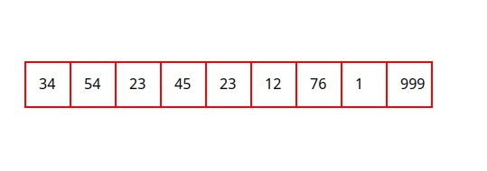
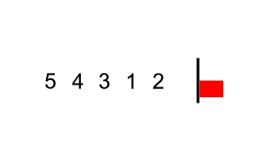
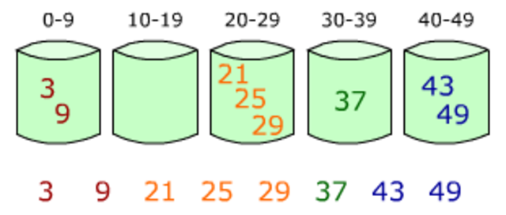

#Algorithms

##Links
- [MIT Introduction to Algorithms](https://www.youtube.com/watch?v=HtSuA80QTyo&list=PLUl4u3cNGP61Oq3tWYp6V_F-5jb5L2iHb&index=1)
- [MIT Advanced Algorithms](https://www.youtube.com/playlist?list=PL6ogFv-ieghdoGKGg2Bik3Gl1glBTEu8c)
- [UC Berkeley Algorithms](https://archive.org/details/ucberkeley-webcast?&and%5B%5D=subject%3A%22Computer%20Science%22&and%5B%5D=subject%3A%22CS%22)

##Search algorithms
- ### Linear Search
    * Given an array of 'n' elements this algorithm is O(n) 
    * Given a multidimensional array of 'n' elements this algorithm is O(n^d) where d = dimensions 

    

- ### Binary Search
    *
    
    
  
- ### Jump Search
    *
    
    
  
- ### Interpolation Search
    *
    
    
  
- ### Exponential Search
    *
    
    
  
- ### Sublist Search (Search a linked list in another list)
    *
    
    
  
- ### Fibonacci Search
    *
   
    
  
- ### The Ubiquitous Binary Search
    *
    
    

##Sorting Algorithms
- ### O(N^2)
    * #### Bubble Sort: swap adjacent elements
        - Is the simplest sorting algorithm that works by repeatedly swapping the adjacent elements if they are in wrong order.
        - Example of bubble sort with a flag:
        
      

    * #### Selection Sort: select smallest unsorted element
        - Sorts an array by repeatedly finding the minimum element (considering ascending order) from unsorted part and putting it at the beginning. The algorithm maintains two subarrays in a given array.

      

    * #### Insertion Sort: insert next element into sorted list
        - The array is virtually split into a sorted and an unsorted part. Values from the unsorted part are picked and placed at the correct position in the sorted part.
    
        

    * #### Bucket Sort:
        - Is a sorting algorithm that works by distributing the elements of an array into a number of buckets. Each bucket is then sorted individually, either using a different sorting algorithm, or by recursively applying the bucket sorting algorithm

        
    
    * #### Radix Sort
        - is a sorting algorithm that like bucket sort, distributes elements of an array into a number of buckets. However, radix sort differs from bucket sort by 're-bucketing' the array after the initial pass as opposed to sorting each bucket and merging
    
        
    
    * #### Shell Sort: Is a optimization of insertion sort
        - This algorithm uses insertion sort on a widely spread elements, first to sort them and then sorts the less widely spaced elements. This spacing is termed as interval. This interval is calculated based on Knuth's formula
        - [Youtube link](https://www.youtube.com/watch?v=ddeLSDsYVp8)
    
- ### O(N LOG(N))
    * #### Quick Sort: Swap around a pivot element.
        - This algorithm use the idea of divide and conquer. This algorithm use a pivot
        
        
              
    * #### Merge Sort: Divide list and merge pieces
        - Divide the unsorted list into n sublists, each containing one element (a list of one element is considered sorted).
        - Repeatedly merge sublists to produce new sorted sublists until there is only one sublist remaining. This will be the sorted list.
      
        
    
    * #### Heap Sort: Selection sort with a heap
        - Heapsort can be thought of as an improved selection sort: like selection sort, heapsort divides its input into a sorted and an unsorted region, and it iteratively shrinks the unsorted region by extracting the largest element from it and inserting it into the sorted region
        - Unlike selection sort, heapsort does not waste time with a linear-time scan of the unsorted region; rather, heap sort maintains the unsorted region in a heap data structure to more quickly find the largest element in each step
        
        
    

##Graph Algorithms
- ###Depth First Search
- ###Breadth First Search
- ###Topological Sort
- ###Dijkstra's Algorithm
- ###Bellman-Ford Algorithm
- ###Floyd-Warshall Algorithm
- ###Prim's Algorithm
- ###Kruskal's Algorithm

##Greedy Algorithms

##Bitmasks

## Extras

- In Place Algorithms: transform input using no auxilary data structure
- Not In Place or Out of Place Algorithms: transform input using auxilary data structure
    

