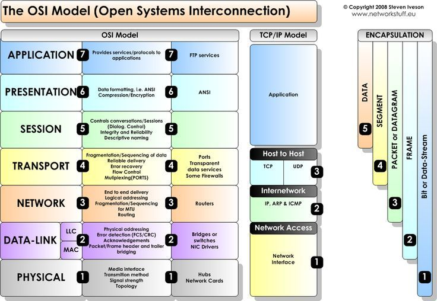

## Networking

### OSI Model
- Standard for exchanging information between and within networks and across geographical boundaries.
  

### HTTP

### FTP

### TCP/IP Protocols

### DNS

### IPv4 vs IPv6

### Firewall

### SSL

### Routing on internet
