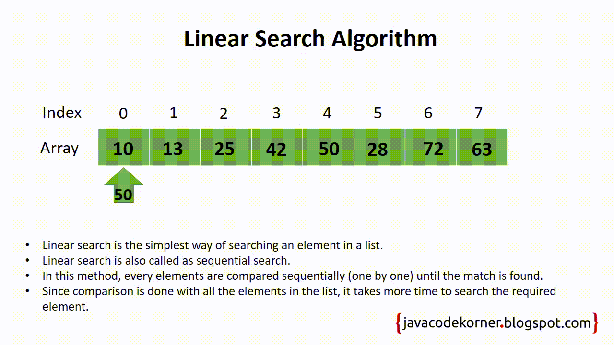

#Algorithms

##Links
- [MIT Introduction to Algorithms](https://www.youtube.com/watch?v=HtSuA80QTyo&list=PLUl4u3cNGP61Oq3tWYp6V_F-5jb5L2iHb&index=1)
- [MIT Advanced Algorithms](https://www.youtube.com/playlist?list=PL6ogFv-ieghdoGKGg2Bik3Gl1glBTEu8c)
- [UC Berkeley Algorithms](https://archive.org/details/ucberkeley-webcast?&and%5B%5D=subject%3A%22Computer%20Science%22&and%5B%5D=subject%3A%22CS%22)


##Search algorithms
- ### Linear Search

```
Given an array of 'n' elements this algorithm is O(n) 
Given a multidimensional array of 'n' elements this algorithm is O(n^d) where d = dimensions 
```

- ### Binary Search
- ### Jump Search
- ### Interpolation Search
- ### Exponential Search
- ### Sublist Search (Search a linked list in another list)
- ### Fibonacci Search
- ### The Ubiquitous Binary Search


##Sorting Algorithms
- ### Bubble Sort
- ### Quick Sort
- ### Merge Sort
- ### Shell Sort
- ### Bucket Sort
- ### Radix Sort

##Graph Algorithms

- ###Depth First Search
- ###Breadth First Search
- ###Topological Sort
- ###Dijkstra's Algorithm
- ###Bellman-Ford Algorithm
- ###Floyd-Warshall Algorithm
- ###Prim's Algorithm
- ###Kruskal's Algorithm

##Greedy Algorithms

##Bitmasks

## Extras

- In Place Algorithms: transform input using no auxilary data structure
- Not In Place or Out of Place Algorithms: transform input using auxilary data structure
    

