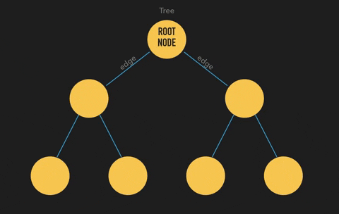

#Data Structures

## Links
- ####[UC Berkeley Data Structures](https://archive.org/details/ucberkeley-webcast?&and%5B%5D=subject%3A%22Computer%20Science%22&and%5B%5D=subject%3A%22CS%22)
- ####[MIT Advanced Data Structures](https://www.youtube.com/watch?v=T0yzrZL1py0&list=PLUl4u3cNGP61hsJNdULdudlRL493b-XZf&index=1)

###Linked Lists

###Stack

###Queue

###Tree

###Hashing

###Binary Tree
[The basics of binary tree](https://dev.to/jenshaw/the-basics-of-binary-trees-2kf8)

###Binary Tree Search - BST

- Are especially useful in algorithms because they are naturally sorted, which makes search, insertion, and deletion of values especially quick and efficient

###Trie

###Fenwick Tree

###Segment Tree

###Heap

###Hashing

###Graph

[https://dev.to/jenshaw/the-basics-of-binary-trees-2kf8]: https://dev.to/jenshaw/the-basics-of-binary-trees-2kf8